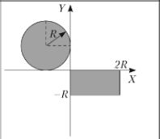

# Fifth laboratory work on the subject "Visual software development tools"
## Project on c++/Qt(Qt Quick)/CMake

## Task 1

Enter outer and inter radius of ring to calculate it area.
* header: [include/task1.h](include/task1.h "Header of first task")
* source: [src/task1.cpp](src/task1.cpp "Source of first task")
* view: [resources/task1.qml](resources/Task1.qml "QML view of first task")

## Task 2

Enter number of month to get it name.
* header: [include/task2.h](include/task2.h "Header of second task")
* source: [src/task2.cpp](src/task2.cpp "Source of second task")
* view: [resources/Task2.qml](resources/Task2.qml "QML view of second task")
* list of months: [resources/json/months.json](resources/json/months.json, "List of months")

## Task 3

Enter coordinates of point(x, y) to get is the point in given area.

* header: [include/task3.h](include/task3.h "Header of third task")
* source: [src/task.cpp](src/task3.cpp "Source of third task")
* view: [resource/Task3.qml](resources/Task3.qml "QML view of thirds task")
* image [resource/images/task3area.png](resources/images/task3area.png "Image of area for third task")
